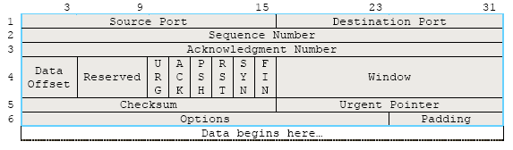

# Sliding Window
## Petunjuk penggunaan program.
1. Ekstrak file TB1_K03_02_Toonderella.zip
2. Buka direktori TB1_K03_02_Toonderella/src di 2 terminal
3. Masukan perintah "make" (tanpa kutip)
4. Jalankan program receiver 
	> ./recvfile​ ​ <filename>​ ​ <windowsize>​ ​ <buffersize>​ ​ <port>
	Contoh : ./recvfile out.txt 1 256 8888
5. Jalankan program sender di terminal yang berbeda
	> ./sendfile <filename> <windowsize> <buffersize> <destination_ip> <destination_port>
	Contoh : ./senderfile in.txt 1 256 127.0.0.1 8888
	*Perhatikan destination_port sender harus sama dengan port receiver*

### Error yang mungkin muncul
1. Cannot Create Socket - terjadi jika gagal membuat UDP socket
2. Bind Failed - terjadi jika port sudah digunakan
3. File Not Found - terjadi jika nama file tidak ditemukan

## Cara kerja sliding window dalam program anda. 
Jelaskan juga fungsi yang terkait dengan sliding window pada program anda dan apa yang dilakukan oleh fungsi tersebut.

## Pembagian tugas. 
Sampaikan dalam list pengerjaan untuk setiap mahasiswa. Sebagai contoh: XXXX mengerjakan fungsi YYYY, ZZZZ, dan YYZZ.
| NIM | Nama | Tugas |
| --- | --- | --- |
| 13515006 | M Rizki Duwinanto | Fungsi ... |
| 13515078 | Veren Iliana Kurniadi | Fungsi ... |
| 13515087 | Aury Nyonata | Fungsi ... |

## Jawaban Pertanyaan
1. Apa yang terjadi jika advertised window yang dikirim bernilai 0? Apa cara untukmenangani hal tersebut?  

2. Sebutkan field data yang terdapat TCP Header serta ukurannya, ilustrasikan, dan jelaskan kegunaan dari masing-masing field data tersebut! 

- **Source TCP port number** (2 bytes) : untuk menyimpan nomor port asal
- **Destination TCP port number** (2 bytes) : untuk menyimpan nomor port tujuan
- **Sequence number** (4 bytes) : untuk menandai urutan kelompok pesan
- **Acknowledgment number** (4 bytes) : untuk meyimpan sequence number dari data yang akan diterima receiver atau yang akan dikirim sender berikutnya
- **TCP data offset** (4 bits) : untuk mengindikasikan dimana data dimulai.
- **Reserved data** (6 bits) : untuk reservasi penggunaan mendatang - selalu berisi nol
- **Control flags** (6 bits) : untuk mengatur data flow pada situasi tertentu
	- URG : untuk menentukan apakah urgent pointer diabaikan atau tidak
	- ACK : untuk menentukan apakah acknowledgement diabaikan atau tidak
	- PSH : untuk memulai fungsi push
	- RST : untuk memaksa koneksi di reset
	- SYN : untuk melakukan sinkronisasi sequence number
	- FIN : untuk mengindikasikan tidak ada lagi data dari sender
- **Window size** (2 bytes) : untuk menyimpan jumlah data yang dikirimkan sender sebelum menerima ACK
- **TCP checksum** (2 bytes) : untuk memeriksa integritas segmen
- Urgent pointer (2 bytes) : untuk menandakan lokasi data yang dianggap penting dalam segmen
- **TCP optional data** (0-40 bytes) : untuk memyimpan beberapa opsi tambahan TCP